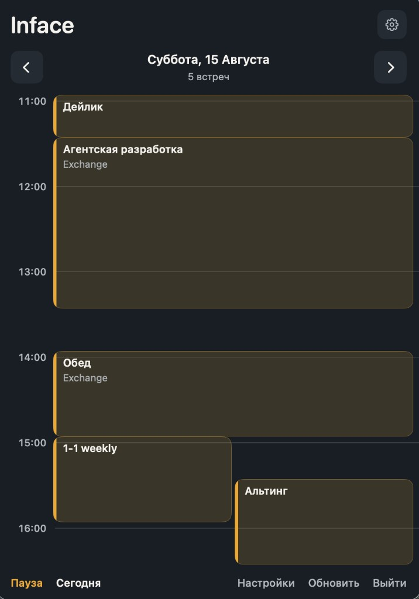
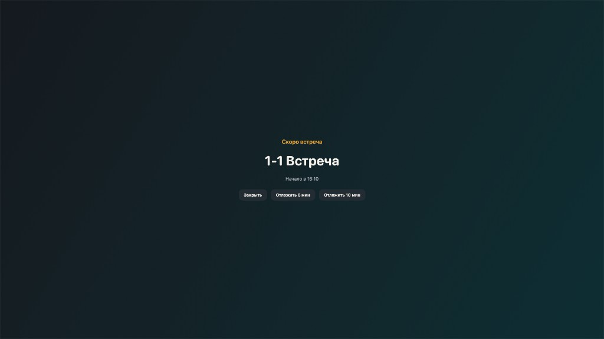

<p align="center">
  
</p>

# Inface

**Полноэкранные напоминания о встречах для macOS** — чтобы звонок нельзя было пропустить.

Inface живёт в строке меню и читает календари через **Apple EventKit** (включая Exchange из «Календаря») или через **прямой корпоративный Exchange (EWS)** (`mailsec.o3t.ru`). За **минуту до** начала встречи показывает полноэкранный алерт. Одним нажатием можно подключиться к Zoom, Google Meet, Teams, ChatZone и другим сервисам.

Язык интерфейса: **русский**.

---

## Скриншоты

<p align="center">
  
  &nbsp;&nbsp;
  
</p>

<p align="center">
  <em>Таймлайн дня в menu bar · Полноэкранный алерт «Скоро встреча»</em>
</p>

---

## Возможности

| Функция | Описание |
|--------|---------|
| Таймлайн в menu bar | Встречи на день, колонки при пересечениях, клик по встрече — детали |
| Полноэкранные алерты | Непропускаемый оверлей ~за 1 минуту до начала (**Подключиться**, отложить 5/10 мин, закрыть) |
| Синхронизация календаря | EventKit **или** прямой Exchange EWS (переключатель в настройках) |
| Локальный кеш | События Exchange сразу из кеша; обновление — в фоне |
| Подключение к встрече | Детект ссылок; **ChatZone / Meetzone** открывается в десктопном ChatZone |
| Запуск при входе | Login item по умолчанию (можно отключить в настройках) |
| Приватность | Данные календаря остаются на Mac — пароли в Keychain, без облачной синхронизации событий |

---

## Требования

- macOS **14+**
- **Xcode** (рекомендуется) или Command Line Tools со Swift 5.9+
- Для EventKit: календари в системном приложении **«Календарь»**
- Для Exchange EWS: корпоративный логин + `код:пароль` от **@mail-bot** в Chatzone

---

## Установка (DMG)

1. Скачайте последний `Inface-*.dmg` из [Releases](https://github.com/stAndrei/inface/releases) (или соберите локально — см. ниже).
2. Откройте DMG и перетащите **Inface** в **Программы**.
3. Запустите Inface.
4. Если Gatekeeper блокирует (ad‑hoc подпись): правый клик → **Открыть**, или разрешите в **Системные настройки → Конфиденциальность и безопасность**.
5. Подключите календарь (доступ EventKit **или** вход в Exchange — см. ниже).
6. Нажмите иконку календаря в строке меню.

По желанию оставьте **«Запускать при входе»** (включено по умолчанию).

---

## Подключение Exchange (EWS)

1. Откройте Inface → **⚙️ / Настройки** (или **⌘,**).
2. **Календарь → Источник → Exchange (EWS)**.
3. **Логин:** `имя@ozon.ru` (например, `petrovan@ozon.ru`).
4. **Пароль:** строка `КОД:ПАРОЛЬ` из **@mail-bot** в Chatzone (не только пароль учётки).
5. Нажмите **Войти**. Сервер по умолчанию: `https://mailsec.o3t.ru/EWS/Exchange.asmx`.

После смены пароля учётки (~раз в 3 месяца) получите новый код у @mail-bot и обновите поле пароля.

---

## Как пользоваться

1. **Иконка в menu bar** — откройте popover со списком встреч на сегодня (или другой день).
2. **Переключатель дня** — предыдущий / следующий день или «Сегодня».
3. **Карточка встречи** — клик по блоку: название, время, место, заметки, ссылка.
4. **Подключиться** — открывает ссылку на встречу (UUID Meetzone — в ChatZone.app).
5. **Выйти** — внизу popover полностью закрывает Inface.
6. **Алерт** — перед началом встречи полноэкранный экран:
   - подключиться / закрыть / отложить / пауза алертов
7. **Настройки**:
   - источник календаря (EventKit / Exchange)
   - за сколько минут предупреждать
   - пауза оповещений
   - запуск при входе в систему

---

## Сборка из исходников

```bash
git clone https://github.com/stAndrei/inface.git
cd inface

# Предпочтительно полный toolchain Xcode
export DEVELOPER_DIR=/Applications/Xcode.app/Contents/Developer
# или: ./Scripts/use-xcode.sh

swift test
./Scripts/package-app.sh
open dist/Inface.app
```

### DMG для раздачи

```bash
./Scripts/package-dmg.sh
# → dist/Inface-<version>.dmg
```

Перезапуск локальной сборки:

```bash
./Scripts/reload-app.sh
```

---

## Структура проекта

- `Sources/InfaceCore` — календарь (EventKit + EWS), алерты, детект ссылок, кеш
- `Sources/InfaceApp` — SwiftUI UI в menu bar и полноэкранный презентер
- `Scripts/package-app.sh` / `package-dmg.sh` / `reload-app.sh` — упаковка и локальный reload
- `openspec/` — продуктовые спеки и история change’ей
- `AGENTS.md` — заметки по локальному multi‑agent workflow

---

## Приватность

Доступ к **Календарю** запрашивается только в режиме EventKit. Учётные данные Exchange хранятся в **Keychain** macOS. События никуда не отправляются. Ссылки на встречи открываются локально через `NSWorkspace` / deep link ChatZone.

---

## Лицензия

MIT — см. [LICENSE](LICENSE).
