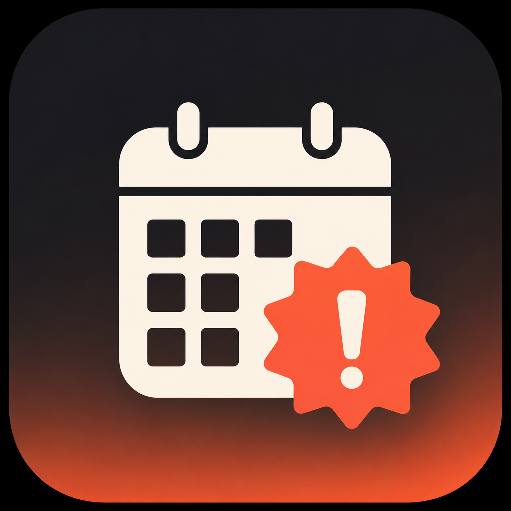

<p align="center">
  
</p>

# Inface

**Fullscreen meeting reminders for macOS** — so you actually notice the call before it starts.

Inface lives in the menu bar, reads your calendars through Apple’s EventKit (including corporate Exchange calendars already set up in Calendar.app), and throws a **fullscreen alert one minute before** each meeting. One click joins Zoom, Google Meet, Teams, ChatZone, and other common links.

UI language: **Russian**.

---

## What it does

| Feature | Details |
|--------|---------|
| Menu bar timeline | Day view of your meetings, side‑by‑side columns for overlaps, click a meeting for details |
| Fullscreen alerts | Unmissable overlay ~1 minute before start (snooze 5/10 min, pause, dismiss) |
| Calendar sync | EventKit — personal + Exchange calendars from Calendar.app |
| Join meeting | Detects conference links; **ChatZone / Meetzone** opens in the ChatZone desktop app |
| Launch at login | Registered as a login item by default (toggle in Settings) |
| Privacy‑first | Calendar data stays on your Mac — no cloud sync of events |

---

## Requirements

- macOS **14+**
- **Xcode** (recommended) or Command Line Tools with Swift 5.9+
- Calendars configured in the system **Calendar** app

---

## Install (DMG)

1. Download the latest `Inface-*.dmg` from [Releases](https://github.com/stAndrei/inface/releases) (or build one locally — see below).
2. Open the DMG and drag **Inface** into **Applications**.
3. Launch Inface.
4. If Gatekeeper blocks it (ad‑hoc signature): right‑click → **Open**, or allow it in **System Settings → Privacy & Security**.
5. Grant **Calendar** access when asked.
6. Click the calendar icon in the menu bar.

Optional: keep **Launch at login** enabled (default) so Inface starts when you sign in.

---

## How to use

1. **Menu bar icon** — open the popover to see today’s (or another day’s) timeline.
2. **Day switcher** — previous / next day, or jump to Today.
3. **Meeting card** — click a block for title, time, location, notes, and join link.
4. **Join** — **Подключиться** opens the meeting link (ChatZone uses the desktop app, not the browser).
5. **Alert** — when a meeting is about to start, a fullscreen sheet appears:
   - join / dismiss / snooze / pause alerts
6. **Settings** (macOS Settings window for Inface):
   - lead time (minutes)
   - pause alerts
   - launch at login

---

## Build from source

```bash
git clone https://github.com/stAndrei/inface.git
cd inface

# Prefer full Xcode toolchain
export DEVELOPER_DIR=/Applications/Xcode.app/Contents/Developer
# or: ./Scripts/use-xcode.sh

swift test
./Scripts/package-app.sh
open dist/Inface.app
```

### Shareable DMG

```bash
./Scripts/package-dmg.sh
# → dist/Inface-0.1.0.dmg
```

---

## Project layout

- `Sources/InfaceCore` — calendar, alerts, link detection
- `Sources/InfaceApp` — SwiftUI menu bar UI + fullscreen presenter
- `Scripts/package-app.sh` / `package-dmg.sh` — release packaging
- `openspec/` — product specs and change history
- `AGENTS.md` — local multi‑agent workflow notes

---

## Privacy

Inface only requests **Calendar** access to schedule reminders and show your agenda. Events are not uploaded. Meeting links are opened locally via `NSWorkspace` / ChatZone deep links.

---

## License

MIT — see [LICENSE](LICENSE).
